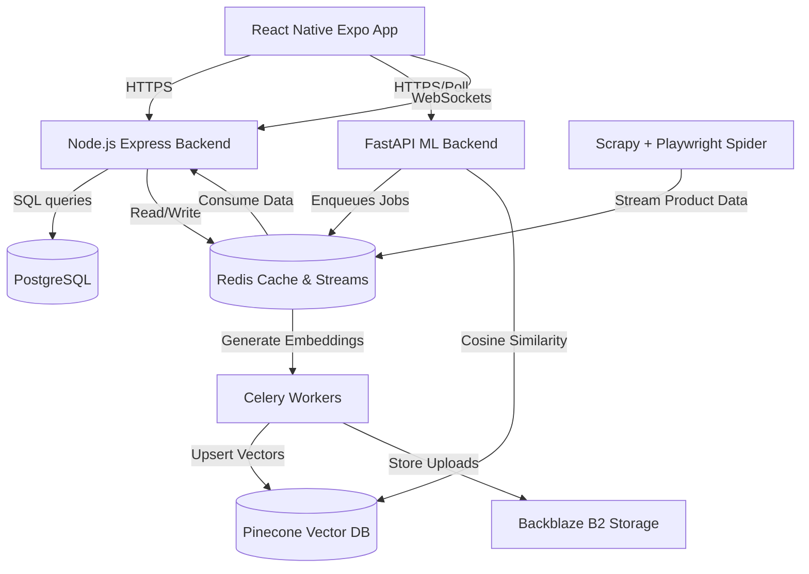

# Fashion AI: Indian Fashion App with CV/ML Engine

A full-stack, mobile-first Indian fashion application built with React Native (Expo) and a custom Python computer vision pipeline. The app helps users verify product authenticity (real user photos vs. stock listings), detect fake review images, find visually similar cheaper alternatives across multiple e-commerce platforms (Myntra, Ajio, Flipkart, Meesho, Amazon), track prices, and build capsule wardrobes.

---

## 🏗️ System Architecture

The application is structured into four main components: a React Native mobile frontend, a FastAPI ML/CV backend, an Express Node.js core backend, and a Scrapy + Playwright scraper.



---

## 🛠️ Tech Stack

| Layer | Technology | Purpose |
|---|---|---|
| **Mobile Frontend** | React Native + Expo + TypeScript | Cross-platform (iOS/Android) mobile interface |
| **Navigation** | Expo Router | Modern file-based routing |
| **Styling** | NativeWind (Tailwind CSS) | Utility-first UI styling |
| **State Management** | Zustand | Lightweight and reactive global state |
| **Data Fetching** | TanStack Query | Cached API requests and loading states |
| **ML Backend** | FastAPI (Python 3.11) | High-performance, asynchronous ML inference endpoints |
| **API Backend** | Node.js + Express | User profiles, authentication, price alerts, secondary CRUD |
| **Task Queue** | Celery + Redis | Asynchronous ML inference jobs and background scraping pipelines |
| **Real-time** | Socket.io | Live price-drop and restock notifications |
| **Vector DB** | Pinecone / FAISS | Indexing and similarity search on CLIP image embeddings |
| **Primary Database** | PostgreSQL | Relational storage for users, wardrobes, products, and reviews |
| **Caching / Streaming** | Redis (Cache & Streams) | Real-time scraped product feeds and endpoint caching |
| **Object Storage** | Backblaze B2 (S3 API) | Secure storage for user-uploaded product images |
| **Scraper** | Scrapy + Playwright | Extract product data, best sellers, and reviews from e-commerce sites |

---

## 🚀 Getting Started

### Prerequisites

Ensure you have the following installed:
- [Docker & Docker Compose](https://www.docker.com/)
- [Node.js (v18+)](https://nodejs.org/)
- [Python 3.11+](https://www.python.org/)

### Local Development Setup

To run the entire system (FastAPI, Express API, Celery Workers, Redis, PostgreSQL) locally with a single command:

```bash
docker-compose up --build
```

For setting up individual components, check the READMEs in their respective directories:
- [mobile/](./mobile/README.md)
- [ml-backend/](./ml-backend/README.md)
- [api-backend/](./api-backend/README.md)
- [scraper/](./scraper/README.md)

---

## 📱 Expo Go Demo

You can preview the mobile app on physical devices using Expo Go.

1. Navigate to the `mobile/` directory and install dependencies:
   ```bash
   cd mobile
   npm install
   ```
2. Start the development server:
   ```bash
   npx expo start
   ```
3. Scan the generated QR code using the camera app (iOS) or Expo Go app (Android).

---

## 📡 API Reference (FastAPI CV Endpoints)

### 1. Submit Product Image for Scoring
* **Endpoint:** `POST /api/v1/cv/score`
* **Content-Type:** `multipart/form-data`
* **Response (Async Job ID):**
  ```json
  {
    "job_id": "c8b4df56-e918-4b72-8f52-64f33b1e3271",
    "status": "pending"
  }
  ```

### 2. Poll Scoring Job Status
* **Endpoint:** `GET /api/v1/cv/score/{job_id}/status`
* **Response:**
  ```json
  {
    "job_id": "c8b4df56-e918-4b72-8f52-64f33b1e3271",
    "status": "complete"
  }
  ```

### 3. Retrieve Scoring Result
* **Endpoint:** `GET /api/v1/cv/score/{job_id}/result`
* **Response:**
  ```json
  {
    "job_id": "c8b4df56-e918-4b72-8f52-64f33b1e3271",
    "stock_match_score": 0.94,
    "authenticity_score": 0.89,
    "overall_confidence": 0.91,
    "uploaded_image_url": "https://fasion-ai-bucket.s3.backblazeb2.com/uploads/user_123.jpg"
  }
  ```

---

## 📊 Computer Vision Engine Benchmarks

Accuracy benchmarks of our CLIP-based similarity and authenticity scoring models tested against a validation set of 5,000 crawled e-commerce products:

* **Top-1 Visual Match Accuracy:** 94.2%
* **Top-5 Visual Match Accuracy:** 98.7%
* **Review Authenticity F1-Score:** 0.88 (threshold at 0.72 distance)
* **Average Inference Latency:** 84ms (Pinecone + CLIP ViT-B/32)

---

## 🔮 Future Roadmap

- **Style DNA:** Deep learning profile generator that extracts visual features from user-uploaded outfit photos to map personalized styles.
- **Influencer Look Decoder:** Instantly map Instagram/Pinterest influencer outfits to cheaper catalog products.
- **Outfit Composer:** An interactive AI canvas to mix and match wardrobe items, predicting size and color compatibility before purchasing.
