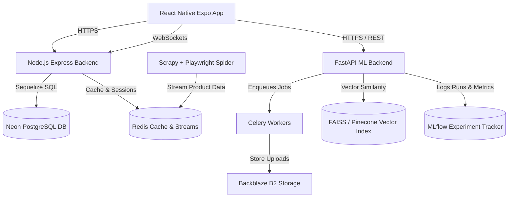

# Fashion AI: Indian Fashion App with CV/ML Engine

A full-stack, mobile-first Indian fashion application built with **React Native (Expo)**, **Node.js (Express)**, and a custom **Python FastAPI Computer Vision (CV) & Machine Learning (ML)** engine. 

The app helps users verify product authenticity (comparing real user photos vs. stock e-commerce listings), detect fake review images, find visually similar cheaper alternatives across multiple e-commerce platforms (Myntra, Ajio, Flipkart, Meesho, Amazon), track price drops, and manage capsule wardrobes with AI gap analysis.

---

## 🚀 Progress & Completed Steps (Build Order 1 – 24 Completed)

The project has achieved **24 out of 26 build order steps**:

- [x] **Step 01–04**: System Architecture, PostgreSQL database models (Neon), FastAPI ML backend scaffold, Node.js API backend scaffold.
- [x] **Step 05–08**: CLIP vector embedding encoder, confidence scorer, fake review image detector, and FAISS/Pinecone vector similarity search.
- [x] **Step 09–13**: E-commerce scraper engine (Scrapy + Playwright), Celery background tasks, Backblaze B2 object storage, multi-platform price engine, and Redis caching.
- [x] **Step 14–16**: Socket.io real-time price alerts, AI capsule wardrobe gap analysis engine, and comprehensive unit test suites.
- [x] **Step 17–19**: Expo React Native mobile scaffold, Clerk authentication router, Home/Trends feed, and Discover personalized recommendation feed (body-type & aesthetic filters).
- [x] **Step 20**: Mobile Computer Vision Scan screen (2-image authenticity comparison & camera scanner).
- [x] **Step 21**: Mobile Product Detail screen, trust score badges, and cross-platform price comparison table.
- [x] **Step 22**: Mobile Digital Wardrobe closet screen with wear counters, category filters, and AI Capsule Gap Analysis card.
- [x] **Step 23**: Mobile Price Drop & Restock Alerts screen, Zustand alert store, and push notification simulator.
- [x] **Step 24**: MLflow experiment tracking for CV model evaluation and accuracy metrics.
- [ ] **Step 25**: Docker containerization & Docker Compose setup *(Upcoming)*.
- [ ] **Step 26**: CI/CD pipeline & production deployment setup *(Upcoming)*.

---

## 🏗️ System Architecture


```mermaid
graph TD
    %% Mobile Frontend
    Mobile[React Native Expo App] -->|HTTPS| NodeAPI[Node.js Express Backend]
    Mobile -->|HTTPS / REST| FastAPIML[FastAPI ML Backend]
    Mobile -->|WebSockets| NodeAPI
    
    %% Databases & Storage
    NodeAPI -->|Sequelize SQL| Postgres[(Neon PostgreSQL DB)]
    NodeAPI -->|Cache & Sessions| RedisCache[(Redis Cache & Streams)]
    
    %% ML & Vector Pipeline
    FastAPIML -->|Enqueues Jobs| Celery[Celery Workers]
    FastAPIML -->|Vector Similarity| FAISS[(FAISS / Pinecone Vector Index)]
    FastAPIML -->|Logs Runs & Metrics| MLflow[(MLflow Experiment Tracker)]
    
    %% Scraper & Storage
    Scraper[Scrapy + Playwright Spider] -->|Stream Product Data| RedisCache
    Celery -->|Store Uploads| B2[Backblaze B2 Storage]
```

---

## 🛠️ Tech Stack & Active Components

| Layer | Technology | Purpose | Status |
|---|---|---|---|
| **Mobile App** | React Native + Expo Router + TypeScript | Cross-platform (iOS/Android) mobile interface | ✅ Built |
| **Mobile Auth** | Clerk Auth (`@clerk/expo`) | Secure user sign-in & JWT session management | ✅ Built |
| **State Management** | Zustand | Reactive global state (Alerts, Wardrobe, Auth) | ✅ Built |
| **ML Backend** | FastAPI + PyTorch + CLIP | Real-time CV inference, embeddings & scoring | ✅ Built |
| **Core API Backend** | Node.js + Express + Sequelize | User data, price alerts, wardrobe CRUD & catalog APIs | ✅ Built |
| **Vector DB** | FAISS / Pinecone | High-speed 512-dim vector similarity search | ✅ Built |
| **Experiment Tracking** | MLflow | Logging model accuracy, parameters, and scan metrics | ✅ Built |
| **Task Queue & Caching** | Celery + Redis | Asynchronous ML inference jobs & Redis cache | ✅ Built |
| **Real-time** | Socket.io | Live price-drop push notification events | ✅ Built |
| **Primary Database** | Neon PostgreSQL | Cloud relational DB for users, products, and wardrobes | ✅ Built |
| **Object Storage** | Backblaze B2 | Cloud S3-compatible image upload bucket | ✅ Built |

---

## ⚡ Local Development Setup

Currently, services run locally directly via Node.js, Python, and Metro bundler (*Docker containerization is scheduled for Build Order Step 25*).

### 1. Prerequisites
- **Node.js**: v18 or higher
- **Python**: 3.11 or 3.13
- **Expo Go App**: Installed on physical mobile phone (iOS / Android) connected to local Wi-Fi.

---

### 2. Running Services Locally

#### A. Start Node.js API Backend (Port 3000)
```bash
cd api-backend
npm install
npm run dev
```

#### B. Start FastAPI ML Backend (Port 8000)
```bash
cd ml-backend
# Activate virtual environment if using one
pip install -r requirements.txt
python -m uvicorn app.main:app --host 0.0.0.0 --port 8000 --reload
```

#### C. Start Mobile Expo App
```bash
cd mobile
npm install
npx expo start
```
*Scan the generated QR code with Expo Go on your mobile device.*

---

## 📡 Key API Endpoints

### 1. Computer Vision Image Scoring
* **Endpoint:** `POST /api/v1/cv/score`
* **Payload:** `{ "product_id": "p-123", "user_id": "u-456", "uploaded_image_url": "https://...", "stock_image_urls": ["https://..."] }`
* **Response:**
  ```json
  {
    "job_id": "c8b4df56-e918-4b72-8f52-64f33b1e3271",
    "status": "complete"
  }
  ```

### 2. Wardrobe Capsule Gap Analysis
* **Endpoint:** `POST /api/v1/wardrobe/gap-analysis`
* **Payload:** `{ "user_id": "u-456", "wardrobe": [{"name": "Jeans", "category": "Bottoms"}], "budget_inr": 5000 }`
* **Response:**
  ```json
  {
    "coverage_score": 0.70,
    "missing_categories": [
      {
        "category": "Formals / Blazers",
        "priority": "high",
        "reason": "Formals are needed for professional settings and interviews.",
        "suggested_budget_inr": 2500
      }
    ],
    "analysis_note": "Good foundation — focus on high-priority gaps."
  }
  ```

---

## 🧪 Automated Test Verification

All modules feature comprehensive automated test suites:

- **Mobile App**: `cd mobile && npm test` (44/44 Jest tests passing)
- **ML Backend**: `cd ml-backend && python -m pytest` (All PyTest test suites passing)
- **TypeScript**: `cd mobile && npx tsc --noEmit` (0 compilation errors)
